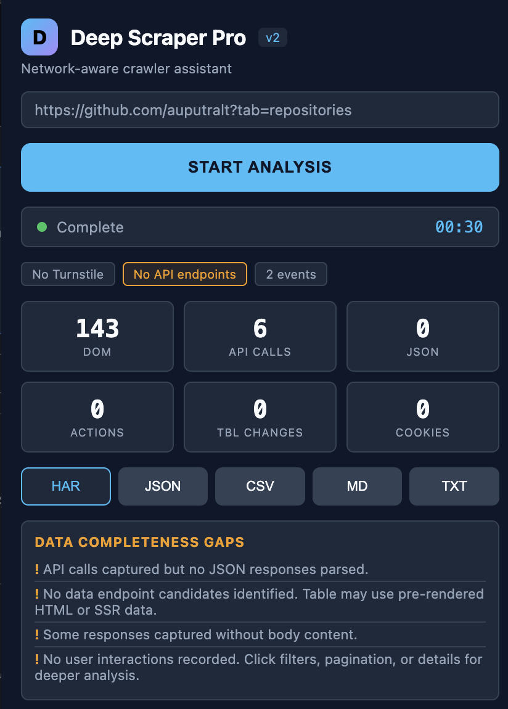

# Deep Scraper Pro

Network-aware crawler assistant for Chrome. Hooks into browser networking to capture, classify, and export every API call, tRPC endpoint, and data stream — automatically.



## Features

### Auto-Capture on Navigation
Extension detects page loads on target domains (e.g. `indotender.com`) and begins capturing network requests immediately — before you click "Start Analysis". A pre-capture buffer (up to 500 requests) stores everything, then merges into your session when you explicitly start.

### Request Classification
Every network request is classified by URL pattern:

| Type | Pattern | Description |
|------|---------|-------------|
| **tRPC** | `/api/trpc/*` | tRPC procedure calls (batch + single) |
| **RSC** | `?_rsc=` | Next.js React Server Components navigation |
| **Auth** | `/login`, `/oauth`, `/token`, `/session` | Authentication endpoints |
| **Asset** | `.js`, `.css`, `.png`, `.woff`, ... | Static resources |
| **Document** | HTML pages | Navigation requests |
| **Other** | everything else | Unclassified API calls |

### tRPC Deep Parsing
Full tRPC batch request support:
- Splits comma-separated procedure names from URL path
- Decodes URL-encoded JSON `input` parameter
- Maps batch items by index key to procedures with parameters
- Infers procedure roles: `table_data`, `filter_metadata`, `detail_data`, `count`
- Parses response JSON to extract field names and data previews

Example parsed tRPC endpoint:
```
lpse.listWithPagination
  Role: table_data
  Params: page, limit, name, lpse, year, winner, workUnit, sortBy, sortOrder
  Response fields: id, title, lpse, date, winner, value, status
```

### Smart Gap Analysis
Analyzes captured data and reports what's missing or could be improved:
- Detects tRPC endpoints with or without response bodies
- Identifies primary table candidates from parsed procedures
- Reports on fetch/XHR hook status, cookie availability, and capture timing
- No more generic "no data" messages — specific, actionable feedback

### Multi-Format Export
Export captured data in 5 formats:

- **HAR** — Full HAR 1.2 timeline with custom `_deepScraper` metadata (tRPC info, classifications, pre-captured requests)
- **JSON** — Structured JSON with all captured endpoints, actions, and metadata
- **CSV** — Spreadsheet-ready with tRPC endpoints, request classifications, and user actions
- **Markdown** — 14-section detailed report with tables for all data types
- **TXT** — Plain text summary

### Privacy
Authorization headers, cookies, and `set-cookie` values are automatically redacted from all exports.

## How It Works

```
Page Load
  |
  +-- webNavigation detects target domain
  |     |
  |     +-- Attaches CDP debugger
  |     +-- Starts pre-capture buffer
  |     +-- Content script injects fetch/XHR hooks
  |
  +-- User clicks "Start Analysis"
        |
        +-- Pre-capture buffer merges into session
        +-- CDP captures Network.request/response events
        +-- Content script tracks DOM mutations & user actions
        +-- Requests classified (tRPC, RSC, auth, asset...)
        +-- tRPC URLs fully parsed
        |
        +-- User clicks "Stop" or navigates away
              |
              +-- Stats, badges, gap analysis updated
              +-- Export buttons enabled
```

## Architecture

| File | Role |
|------|------|
| `manifest.json` | MV3 config — permissions, content scripts, service worker |
| `background.js` | Service worker — CDP network capture, tRPC parsing, webNavigation, pre-capture buffer, export logic |
| `content.js` | Content script — DOM observer, action recorder, fetch/XHR hook injection, auto-inject on page load |
| `injected-page.js` | Main-world script — fetch/XHR interception, action tracking |
| `popup.html` | Popup UI — stats grid (9 cards), badges, export buttons |
| `popup.js` | Popup logic — state rendering, gap analysis, HAR/JSON/CSV/MD/TXT generation |

## Installation

1. Clone this repo:
   ```bash
   git clone https://github.com/auputralt/Deep-Scraper-PRO.git
   ```
2. Open Chrome and go to `chrome://extensions/`
3. Enable **Developer mode** (top-right toggle)
4. Click **Load unpacked** and select the cloned folder
5. Pin the extension to your toolbar

## Usage

1. Navigate to a target website
2. Click the extension icon to open the popup
3. The extension auto-captures network traffic on supported domains
4. Click **Start Analysis** to begin an active session (pre-captured data merges in)
5. Interact with the page — browse, click, filter, paginate
6. Click **Stop Analysis** when done
7. Review stats, badges, and gap analysis
8. Export in your preferred format

## Stats Dashboard

9 real-time stat cards:
- **DOM** — DOM mutation events captured
- **API Calls** — fetch/XHR intercepts
- **tRPC** — tRPC procedure endpoints detected
- **JSON** — JSON response bodies parsed
- **Actions** — User interactions recorded
- **Tbl Changes** — Table mutation events
- **RSC** — Next.js RSC navigation requests
- **Pre-captured** — Requests captured before session start
- **Cookies** — Cookie data available

## Badges

Contextual badges show active detection:
- `tRPC: procedureName` — Detected tRPC endpoints with procedure names
- `RSC: N requests` — Next.js Server Components activity
- `Pre-captured: N` — Requests buffered before session start
- `Auth detected` — Authentication endpoints found
- `Cloudflare Turnstile` — Anti-bot challenge detected

## Technologies

- Chrome Extension Manifest V3
- Chrome DevTools Protocol (CDP) via `chrome.debugger`
- `chrome.webNavigation` for early page load detection
- Content script injection with `chrome.scripting.executeScript`
- HAR 1.2 specification
- Privacy-first: automatic header redaction

## License

MIT
